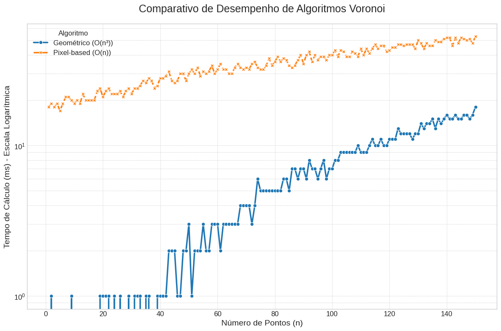

# 📊 Análise Comparativa de Algoritmos para Diagrama de Voronoi
### Trabalho da Disciplina de Programação Avançada - Ciência da Computação, UFPel

Implementação e análise de desempenho de dois algoritmos para a geração de Diagramas de Voronoi: um incremental (geométrico) e um de força bruta (pixel-based).

---

## Aplicação que utiliza o Diagrama de Voronoi: Astronomia e a Estrutura Cósmica

### O Desafio: Mapeando o Vazio do Universo

Quando olhamos para o universo em grande escala, as galáxias não estão distribuídas de forma uniforme. Elas se organizam em uma estrutura complexa e filamentar, conhecida como a **"teia cósmica"** (*cosmic web*). Essa teia é composta por densos aglomerados de galáxias, longos filamentos que as conectam e, entre tudo isso, vastas regiões de espaço quase completamente vazio.

Essas regiões, conhecidas como **vazios cósmicos**, são componentes fundamentais da estrutura do universo, mas identificá-las e definir suas fronteiras é um desafio complexo. Como podemos, a partir de um conjunto de pontos (as galáxias), definir objetivamente as áreas que representam o "nada"?

### A Solução Geométrica: Tesselação de Voronoi

É aqui que o Diagrama de Voronoi se torna uma ferramenta poderosa. Os cosmologistas aplicam este método da seguinte forma:

1.  **Mapeamento das Galáxias**: Os dados de levantamentos astronômicos (como o *Sloan Digital Sky Survey*) fornecem as posições tridimensionais de milhões de galáxias. Cada galáxia é tratada como um "ponto" ou "semente" no espaço.

2.  **Construção do Diagrama**: Um Diagrama de Voronoi 3D (ou tesselação) é construído a partir desses pontos. O espaço do universo é dividido em células poliédricas, onde cada célula contém exatamente uma galáxia. A principal propriedade se mantém: qualquer ponto dentro de uma célula está mais próximo da galáxia contida nela do que de qualquer outra.

3.  **Identificação dos Vazios**: As células de Voronoi associadas a galáxias em regiões de baixa densidade serão, por natureza, muito maiores do que as células em aglomerados densos. Os vazios cósmicos correspondem, portanto, às maiores células do diagrama. Ao analisar a distribuição dos volumes dessas células, os cientistas podem:
    * **Identificar vazios de forma objetiva**: Em vez de uma inspeção visual subjetiva, o método fornece uma definição matemática para o que constitui um vazio.
    * **Medir suas propriedades**: É possível calcular o volume, a forma e a distribuição dos vazios, informações cruciais para testar modelos cosmológicos.
    * **Estudar a física dos vazios**: Essas regiões não são completamente vazias; elas são dominadas por energia escura e podem conter matéria escura. O estudo da forma e do tamanho dos vazios ajuda os cientistas a entender a natureza da energia escura e a taxa de expansão do universo.

### Por que é Tão Impactante?
  Esta aplicação demonstra como um conceito de geometria computacional pode ser usado para responder a perguntas fundamentais sobre o universo. A técnica de tesselação de Voronoi oferece uma maneira elegante e não paramétrica de caracterizar a estrutura da teia cósmica, permitindo que os astrônomos transformem um "mapa de pontos" de galáxias em um mapa estruturado de filamentos e vazios.

Isso nos ajuda a testar o Modelo Cosmológico Padrão (Lambda-CDM) e a entender as forças, como a gravidade e a energia escura, que esculpiram o universo na forma como o vemos hoje.

---

### 🎥 Vídeos Demonstrativos

Nesses vídeos, demonstro o funcionamento de cada algoritmo implementado na aplicação web.

| Algoritmo Incremental (Geométrico) | Algoritmo de Força Bruta (Pixel-based) |
| :---: | :---: |
| [Assistir Vídeo](videos-demonstrativos/Diagrama-de-Voronoi-Incremental-e-Triangulacao-de-Deulanay.mp4) | [Assistir Vídeo](videos-demonstrativos/Diagrama-de-Voronoi-Forca-Bruta.mp4) |

---

### 📝 Descrição do Projeto

Este projeto implementa e compara o desempenho de dois algoritmos distintos para a geração de Diagramas de Voronoi:

1.  **Algoritmo Incremental (Geométrico, uma abordagem de recorte de polígonos que calcula as bordas exatas de cada célula.
2.  **Algoritmo de Força Bruta (Pixel-based, uma abordagem que determina a célula mais próxima para cada pixel na tela.

A aplicação web (`/app`) permite a coleta de dados de desempenho, que são analisados em um Notebook do Google Colab (`/analise`) para comparar o impacto do número de pontos e de sua distribuição no tempo de execução.

---

### 🛠️ Tecnologias Utilizadas

#### Frontend e Coleta de Dados
-   HTML5
-   JavaScript 
-   Canvas 

#### Análise de Dados e Visualização
-   Google Colab (Ambiente de Notebook)
-   Python 3
-   Pandas (para manipulação de dados)
-   Matplotlib e Seaborn (para geração de gráficos)

---

### 📈 Resultados e Análise

Os resultados completos, incluindo os gráficos de desempenho e as conclusões, podem ser encontrados no notebook `analise/analise_Desempenho_e_Graficos.ipynb`.

#### Simulação Manual do Funcionamento

Para ilustrar o processo lógico do algoritmo incremental, foi feita uma simulação manual passo a passo. A imagem abaixo demonstra como o polígono de uma célula é progressivamente recortado pelas mediatrizes dos pontos vizinhos.


#### Comparativo Geral de Desempenho


### Custo Computacional:
O algoritmo geométrico, (O(n²)) no caso medio, é melhor quando o número de pontos n é pequeno, médio, pois ele não se importa com o tamanho da tela. Ele calcula a estrutura exata do diagrama.

Este algoritmo de grade (O(P * n)) pode ser mais rápido quando n é muito grande e a resolução P é relativamente baixa. No entanto, ele apenas produz uma aproximação visual do diagrama, não a sua definição geométrica precisa.

---
### 🚀 Como Executar

#### Parte 1: Aplicação Web para Coleta de Dados

A aplicação não requer um servidor web e pode ser executada localmente.

1.  **Clone o repositório:**
    ```bash
    git clone https://github.com/kerwald/voronoi-diagram
    ```
2.  **Abra o arquivo:**
    Navegue até a pasta `app/` e abra o arquivo `index.html` em qualquer navegador web moderno (Chrome, Firefox, Edge, etc.).
3.  **Utilize a aplicação:**
    -   Adicione pontos clicando na tela ou usando os botões.
    -   Exporte os arquivos de dados `.csv` para a análise.

#### Parte 2: Análise dos Dados no Colab

1.  **Acesse o Google Colab:**
    Vá para [colab.research.google.com](https://colab.research.google.com).
2.  **Carregue o Notebook:**
    Clique em `File > Upload notebook...` e selecione o arquivo `analise/analise_Desempenho_e_Graficos.ipynb` do repositório.
3.  **Execute as células:**
    -   Execute a célula que pede o upload dos arquivos.
    -   Envie os arquivos `.csv` que você gerou na aplicação web.
    -   Execute as células restantes para visualizar os gráficos e a análise completa.

---

### 👨‍💻 Autor

**FELIPE LEONARDO KERWALD SANTANA**

-   **Email:** [flksantana@inf.ufpel.edu.br]
-   **GitHub:** [@kerwald](https://github.com/kerwald)
-   **LinkedIn:** [Felipe Kerwald](https://www.linkedin.com/in/felipekerwald/])

---
